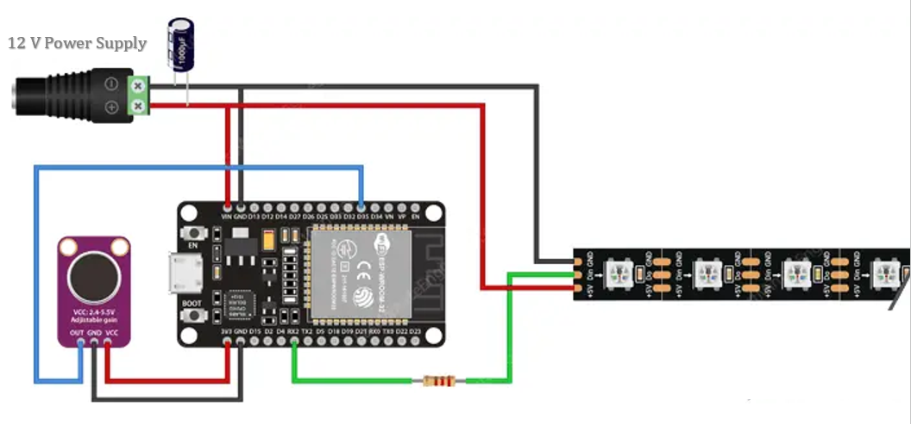

# 🎵 Music Reactive LED Strip with ESP32

A real-time audio-reactive LED visualizer using an ESP32, MAX9814 analog microphone, and WS2811 RGB LED strip. It responds to music and ambient sounds by lighting up LEDs in a rainbow gradient bar based on volume.

---

## 📸 Demo Preview

> *(Insert GIF or YouTube video link here)*  
> _“Watch how the LED bar dances to music beats!”_

---

## 🔧 Tools & Components

| Component         | Details                                 |
|------------------|------------------------------------------|
| Microcontroller  | ESP32 Dev Module                         |
| Microphone       | MAX9814 Analog Mic Module (Auto Gain)    |
| LED Strip        | WS2811 Addressable RGB Strip (12V, 75 LEDs) |
| Power Supply     | 12V DC Adapter                           |
| Programming      | Arduino IDE (C++)                        |
| Libraries Used   | [Adafruit NeoPixel](https://github.com/adafruit/Adafruit_NeoPixel) |

---

## ⚙️ How It Works (Architecture)

1. **Audio Input:**  
   MAX9814 mic captures ambient sound and sends analog signal to ESP32 ADC.

2. **Amplitude Calculation:**  
   ESP32 reads analog values, removes DC bias, and calculates smoothed amplitude.

3. **Signal Mapping:**  
   Audio amplitude is mapped to the number of LEDs to light up.

4. **Rainbow Visualization:**  
   A custom colorWheel() function generates rainbow colors along the LED bar.

5. **Smooth Fade-Off:**  
   A fall-off effect makes the light bar shrink smoothly when the music gets quieter.

---

## 🔌 Circuit Diagram

>   
> _**Note:** WS2811 DIN → GPIO 14, Mic OUT → GPIO 36_

---

## 📜 Arduino Code Overview

- `analogRead(MIC_PIN)` reads mic signal.
- `baseline` handles DC bias from the mic.
- `colorWheel()` generates rainbow color per LED.
- `ledcWrite()` is **not used**, since WS2811 is handled by Adafruit NeoPixel.

---

## ⚙️ Customizable Parameters

| Variable      | Purpose                                      | Suggested Value |
|---------------|-----------------------------------------------|-----------------|
| `BRIGHT_MAX`  | Max brightness of LEDs                        | 200–255         |
| `THRESHOLD`   | Noise floor cutoff (filters ambient noise)    | 50–80           |
| `MAP_MAX`     | Sensitivity mapping max volume                | 500–800         |
| `FALL_RATE`   | Speed at which bar drops after loud beat      | 1–5             |

---

## 🧠 Skills Highlighted

- Embedded systems (ESP32 ADC + NeoPixel)
- Analog signal processing (bias removal + smoothing)
- Real-time audio-reactive animation
- PWM-free LED control using WS2811 timing protocol
- System tuning and hardware integration

---

## 📦 Bill of Materials (BOM)

- ESP32 Dev Board  
- MAX9814 Analog Microphone  
- WS2811 RGB LED Strip (75 LEDs)  
- 12V DC Power Adapter (2A or higher)  
- 1000µF Capacitor (optional but recommended across LED power)  
- Breadboard and jumper wires

---

## 🚀 Future Enhancements

- Add FFT for frequency band visualization  
- Expand to full 3-channel RGB (or use NeoPixel Ring)  
- Implement web-based settings tuner via ESP32 web server  
- Bluetooth or aux input option instead of mic

---

## 🧑‍💻 Author

**Yashwanth Kumar D**  
[GitHub](https://github.com/YaswanthKumarD752) | [LinkedIn](https://www.linkedin.com/in/yashwanth-kumar-d-6398261b2/)

---

## 📄 License

This project is open-source and available under the MIT License.
